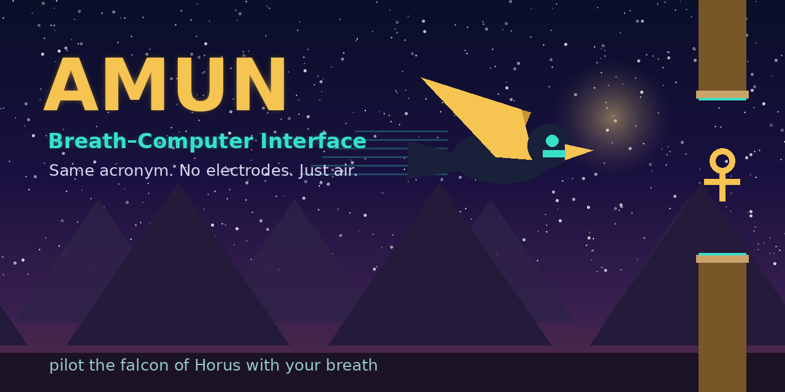
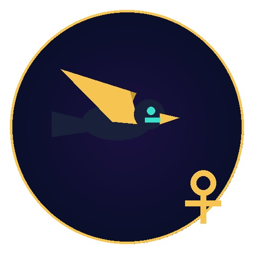

<div align="center">



# 𓅃 Amun — a Breath–Computer Interface

**Same acronym. No electrodes. Just air.**

Pilot the falcon of Horus across the Egyptian sky using nothing but your breath.
Soft breath glides · a hard exhale climbs · silence dives into gravity.


</div>

---

> A ground-up reimagining of [`CoffeeIsAllYouNeed/Invisible-Driver`](https://github.com/CoffeeIsAllYouNeed/Invisible-Driver).
> The original was a **Brain**–Computer Interface — drive a car with EEG brain waves
> through an Arduino, electrodes and a clustering model. **Amun keeps the exact
> acronym and changes the principle:** here **BCI** means **Breath**–Computer
> Interface. The signal source becomes the microphone every device already has —
> no electrodes, no Arduino, fully offline.

## Why this is "the same idea, but better"

| | Invisible-Driver (original) | **Amun** (this repo) |
|---|---|---|
| Principle | **Brain** waves (EEG) | **Breath** (acoustic) — *and optionally brain, see below* |
| Hardware | Arduino + BioAmp + gel electrodes | **None** — any microphone |
| Acronym | Brain–Computer Interface | **Breath**–Computer Interface |
| Game | drive a racing car | fly the falcon of Horus over Egypt |
| Dependencies | Python ML stack + serial | **zero** for the core game |
| Runs offline | partly | **100% offline** |

The science still lives in Python — a real `ingestion → preprocessing → features →
classify → engine` pipeline with **k-means calibration** — but the microphone moves
into the browser, so the whole thing runs with **no third-party dependencies**.

## Quickstart

```bash
git clone https://github.com/Lord1Egypt/Amun
cd Amun
python -m amun           # opens the game in your browser
```

Allow the microphone and **breathe**. No microphone? Press and hold **SPACE**.

Headless / no browser (great for a quick check or CI):

```bash
python -m amun --source sim --duration 5 --no-input
```

## How the breath becomes flight

```
microphone ─▶ ingestion ─▶ preprocessing ─▶ features ─▶ classify ─▶ engine ─▶ render
 (browser)    loudness      noise-floor +     RMS /      k-means      falcon    canvas
              frames        EMA smoothing     ZCR        anchors      physics
```

- **Silence** → no thrust → gravity → the falcon **dives**.
- **Soft breath** → partial thrust → the falcon **glides** level.
- **Hard exhale** → full thrust → the falcon **climbs**.

Deep dive: [`docs/ARCHITECTURE.md`](docs/ARCHITECTURE.md) ·
[`docs/SIGNAL_PIPELINE.md`](docs/SIGNAL_PIPELINE.md) ·
[`docs/CALIBRATION.md`](docs/CALIBRATION.md).

## Optional hardware (it works without any)

Amun is "the hidden one" — it accepts any *invisible* signal, but **always falls
back to the microphone** if no hardware is present.

| Tier | Input | What you need |
|---|---|---|
| **0 · default** | breath via browser mic | nothing |
| **1 · DIY** | the **Amun Amulet** — breath sensor + OLED + RGB + buzzer | Arduino/ESP32 + parts |
| **2 · Brain** | a **NeuroSky MindWave** (real EEG attention) | the headset |

```bash
amun --source serial   --serial-port /dev/rfcomm0   # Amun Amulet (breath)
amun --source neurosky --serial-port /dev/rfcomm0   # NeuroSky (brain)
# if the device isn't found, Amun automatically uses the browser mic
```

Tier 2 brings the original "control with your mind" idea back as a bonus — so Amun
is a **superset** of Invisible-Driver. Full build, BOM and wiring:
[`docs/HARDWARE.md`](docs/HARDWARE.md).

## Project layout

```
src/amun/      engine · ingestion · preprocessing · features · classify · calibrate · server · thinkgear
templates/     the browser game (Web Audio mic + canvas renderer)
model/         your calibration profile (JSON)
tools/         sample data · demo-gif · banner/logo · Gemini asset gen · test runner
tests/         pytest suite (engine · features · classify · websocket · server · thinkgear)
notebooks/     breath-signal exploration + honest clustering metric
docs/          architecture & guides     hardware/  Amun Amulet sketch + BOM
```

## Tests

```bash
pip install -e ".[dev]"
python tools/test_all.py        # data + calibration + headless run + pytest (exit 0)
```

See [`TESTING.md`](TESTING.md). Everything runs with **no microphone and no hardware**.

## Honesty note

All performance/quality numbers (e.g. the calibration **silhouette score**) are
**measured** on bundled, reproducible data — never invented. Your own calibration
produces a score for your microphone and breathing.

## Status

Live build log: [`CHECKPOINTS.md`](CHECKPOINTS.md).

## License

MIT © 2026 Mohamed Mounir ([Lord1Egypt](https://github.com/Lord1Egypt))

<div align="center"></div>
